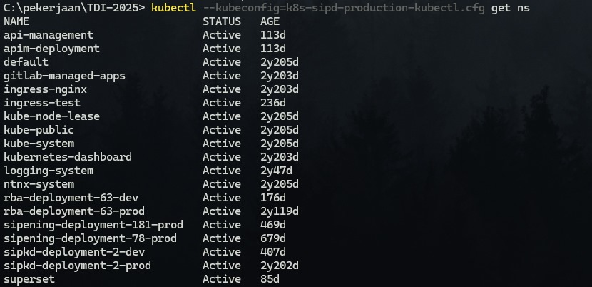
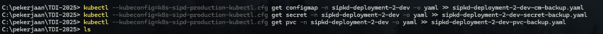
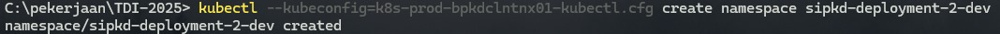
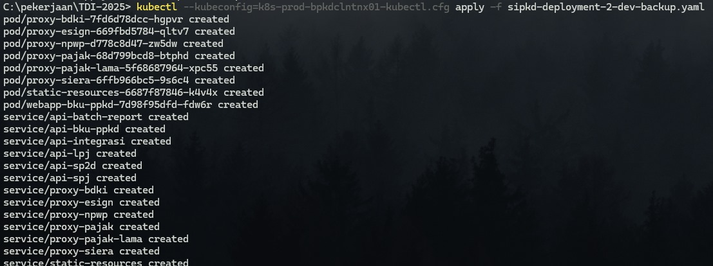
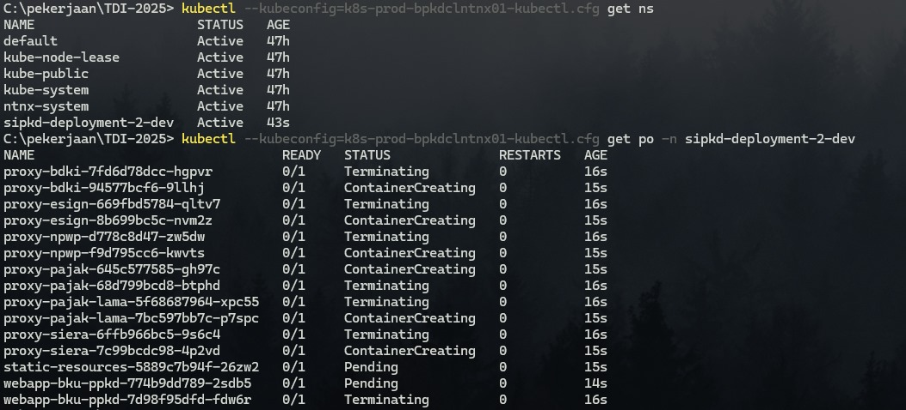
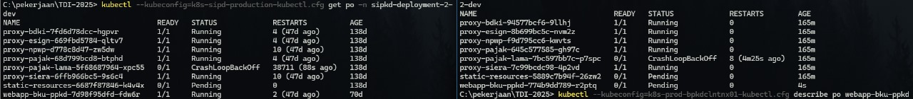

### **Cek Namespace**
1. **Cek Semua Namespace di K8s-old**
   Gunakan perintah berikut untuk cek semua namespace di kuberntes-old:
   ```bash
   kubectl --kubeconfig=[kubeconfig].cfg get ns
   ```
   


### **Langkah 1: Backup Namespace**
1. **Ekspor Semua Resource di Namespace**
   Gunakan perintah berikut untuk mengekspor semua resource di namespace `<your-namespace>` ke file YAML:
   ```bash
   kubectl get all -n [namespace-deployment] -o yaml > [namespace-deployment-backup].yaml
   ```
   


2. **Ekspor ConfigMaps dan Secrets**
   ```bash
   kubectl get configmap -n [namespace-deployment] -o yaml >> [namespace-deployment-cm-backup].yaml
   kubectl get secret -n [namespace-deployment] -o yaml >> [namespace-deployment-secret-backup].yaml
   ```

3. **Ekspor PersistentVolumeClaims (PVCs)**
   ```bash
   kubectl get pvc -n [namespace-deployment] -o yaml >> [namespace-deployment-pvc-backup].yaml
   ```

   


---

### **Langkah 2: Backup Data Persistent Volume (Jika Diperlukan)**
- **Untuk Storage Cloud (misalnya, AWS EBS, GCP PD, atau Azure Disk):**
  Pastikan volume dapat dipasang ulang di cluster baru tanpa kehilangan data.
  
- **Untuk Penyimpanan Lokal:**
  Salin data PVC secara manual ke lokasi aman. Anda bisa menggunakan tool seperti **rsync**:
  ```bash
  rsync -avz /path/to/volume /backup/location
  ```

---

### **Langkah 3: Restore ke Cluster Baru**
1. **Buat Namespace Baru di Cluster Baru**
   Jika namespace belum ada di cluster baru, buat namespace:
   ```bash
   kubectl create namespace [namespace-deployment]
   ```
   


2. **Terapkan Backup File**
   Terapkan resource yang telah di-backup ke cluster baru:
   ```bash
   kubectl apply -f [namespace-deployment-backup].yaml
   ```
   


3. **Re-attach Persistent Volumes (Jika Ada)**
   Jika menggunakan storage yang perlu dipasang ulang, pastikan konfigurasi PersistentVolume (PV) diupdate dengan `volumeHandle` atau `storageClassName` sesuai cluster baru.

---

### **Langkah 4: Validasi**
1. **Cek Resource**
   Pastikan semua resource berjalan:
   ```bash
   kubectl get all -n [namespace-deployment]
   ```
   


2. **Uji Aplikasi**
   Akses aplikasi dan pastikan fungsionalitasnya berjalan sesuai harapan.
   


---

### **Tips Tambahan**
- Gunakan **Velero** untuk backup dan restore namespace secara otomatis, termasuk Persistent Volume:
  ```bash
  velero backup create sipkd-backup --include-namespaces sipkd-deployment-2-prod
  velero restore create --from-backup sipkd-backup
  ```

Jika ada kendala spesifik, beri tahu saya! 😊